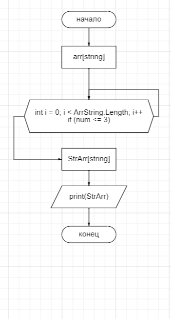

# ИТОГОВАЯ ПРОВЕРОЧНАЯ РАБОТА

## .1 ***Создан репозиторий GitHub:***
[*Ссылка на репозиторий*](https://github.com/Kubinic/FinalVerificationWork.git)

## .2 ***Блок схема алгоритма*** 

## .3 ***Программа:*** *SortLengArr*
> ___Программа написана на языке C#  и сортирует массив, заполненный строками разного размера и выдаёт массив, состоящий из строк, длина которых меньше или равна трём символам.___

---
# ***Над проэктом работали:***

### *Написание програмного кода:* ***Осипцов А.Г.***

### *Git-репозиторий :* ***Осипцов А.Г.***

### *Составление блок схемы :* ***Осипцов А.Г.***

### *Написание **README.md** :* ***Осипцов А.Г.***